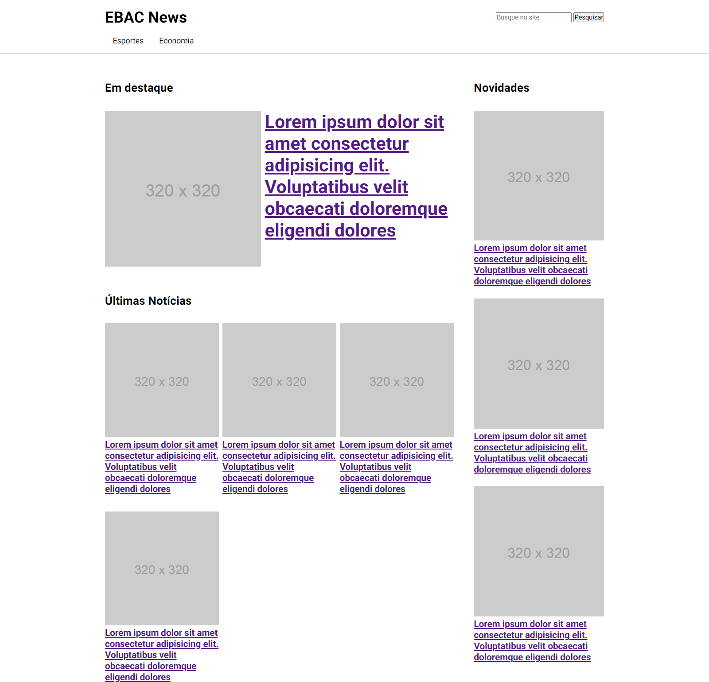

<h1 align="center"> CSS-Responsivo </h1>

 Atividade proposta pela EBAC, que consiste em realizar os ajustes necessários para o site se tornar legÍvel em varios tamanhos de telas. Foi utilizado também *JQUERY* no menu.

    
 
    

    

    

    

    
 
<h2 align="center"> Desenvolvido por:
</h2>

<h3 align="center"> Renata Ribeiro 

</h3>
  
